# BMAD Pack

This pack implements the Gas City `build-base` workflow contract with vendored
[BMAD Method](https://github.com/bmad-code-org/BMAD-METHOD) skills.

## What It Provides

- Formula: `bmad-build`
- Expansion formulas: `bmad-code-review-flow`
- Implementation item formulas: `bmad-story-development`,
  `bmad-story-development-item`
- Vendored skills: `bmad-prd`, `bmad-create-architecture`,
  `bmad-check-implementation-readiness`, `bmad-create-epics-and-stories`,
  `bmad-quick-dev`, `bmad-dev-story`, `bmad-code-review`,
  `bmad-brainstorming`, and `bmad-spec`
- Provenance: `vendor/bmad-method/upstream.toml`

BMAD maps naturally onto the full lifecycle base: PRD, architecture,
epics/stories, implementation readiness, implementation, review, finalize, and
publish.

BMAD quick-dev and code-review describe sub-agent/task handoffs and parallel
review layers. This pack converts those shapes into Gas City item formulas and
expansion formulas with explicit implementation, self-check, acceptance-audit,
adversarial review, synthesis, and fix lanes. The vendored skill files are
source material only; the workflow must not invoke provider-native subagents,
slash commands, task tools, or the upstream plugin runtime.

## End-to-End Flow

The BMAD pack keeps BMAD's PRD, architecture, epics/stories, readiness,
quick-dev, and adversarial review shape, but maps native handoffs onto Gas City
beads, drains, and graph loops.

```mermaid
flowchart TD
    classDef inherited fill:#eef2ff,stroke:#4f46e5,color:#111827;
    classDef bmad fill:#ecfdf5,stroke:#059669,color:#111827;
    classDef infra fill:#fff7ed,stroke:#d97706,color:#111827;
    classDef terminal fill:#f9fafb,stroke:#6b7280,color:#111827;

    Start["Launch bmad-build"]:::terminal --> Prepare["prepare<br/>inherited build-base"]:::inherited
    Prepare --> PRD["requirements<br/>BMAD PRD override"]:::bmad
    PRD --> Architecture["plan<br/>BMAD architecture override"]:::bmad
    Architecture --> ArchReview["plan-review<br/>BMAD architecture handoff override"]:::bmad
    ArchReview --> Decompose["decompose<br/>BMAD epics and stories override"]:::bmad
    Decompose --> Readiness["implementation-readiness<br/>BMAD readiness gate override"]:::bmad
    Readiness --> DrainChoice{"drain policy<br/>Gas City drain"}:::infra
    DrainChoice -->|separate| DrainSeparate["separate drain<br/>parallel by convoy deps"]:::infra
    DrainChoice -->|same-session| DrainShared["same-session drain<br/>single worker lane"]:::infra

    subgraph StoryFormula["bmad-story-development item formula: one formula instance per story bead"]
        direction TB
        SeparatePrep["prepare-worktree<br/>inherited do-work<br/>separate drain only"]:::inherited --> StoryLoopStart["run BMAD story development<br/>override control step"]:::bmad
        SharedStoryStart["run BMAD shared story development<br/>override implement-item"]:::bmad
        StoryLoopStart --> StorySetup["setup-bmad-story-development"]:::bmad
        SharedStoryStart --> StorySetup
        StorySetup --> ImplementStory["implement-story"]:::bmad
        ImplementStory --> SelfCheck["story-self-check"]:::bmad
        SelfCheck --> AcceptanceAudit["acceptance-audit"]:::bmad
        AcceptanceAudit --> ApplyStory["apply-story-findings"]:::bmad
        ApplyStory --> StoryGate{"story clean?<br/>implementation-review check"}:::infra
        StoryGate -->|no: fix story and re-check| StorySetup
        StoryGate -->|yes| StoryDone["story accepted"]:::bmad
        StoryDone --> CloseStory["close source anchor<br/>inherited do-work<br/>separate drain only"]:::inherited
    end

    DrainSeparate --> SeparatePrep
    DrainShared --> SharedStoryStart
    CloseStory --> DrainFanIn["fan in<br/>drain waits for all item roots"]:::infra
    StoryDone --> DrainFanIn

    DrainFanIn --> ReviewSetup["review<br/>BMAD code-review override"]:::bmad

    subgraph CodeReview["post-implementation review override: BMAD review loop"]
        direction TB
        ReviewSetup --> GatherContext["gather-bmad-review-context"]:::bmad
        GatherContext --> ReviewFanout["fan out BMAD review lanes"]:::infra

        subgraph ReviewLanes["parallel reviewer lanes: sibling beads with no needs between them"]
            direction LR
            BlindHunter["blind-hunter-review"]:::bmad
            EdgeCase["edge-case-review"]:::bmad
            AcceptanceReview["acceptance-auditor-review"]:::bmad
            GapReview["gap-analysis-review"]:::bmad
        end

        ReviewFanout --> BlindHunter
        ReviewFanout --> EdgeCase
        ReviewFanout --> AcceptanceReview
        ReviewFanout --> GapReview
        BlindHunter --> ReviewFanIn["fan in<br/>wait for all review artifacts"]:::infra
        EdgeCase --> ReviewFanIn
        AcceptanceReview --> ReviewFanIn
        GapReview --> ReviewFanIn
        ReviewFanIn --> ReviewSynth["synthesize-bmad-review"]:::bmad
        ReviewSynth --> ApplyReview["apply-bmad-review-findings"]:::bmad
        ApplyReview --> ReviewGate{"implementation approved?<br/>graph check"}:::infra
        ReviewGate -->|no: fix and re-review| ReviewFanout
        ReviewGate -->|yes| ReviewDone["finalize BMAD code review"]:::bmad
    end

    ReviewDone --> Finalize["finalize<br/>inherited build-base"]:::inherited
    Finalize --> Publish["publish<br/>inherited build-base"]:::inherited
    Publish --> Done["workflow complete"]:::terminal
```



Blue nodes are inherited Gas City behavior, green nodes are BMAD-specific
overrides, and amber nodes are Gas City graph, convoy, or drain infrastructure.
The story-development item formula loops per implementation bead until the
story self-check and acceptance audit are clean. After the convoy drains, the
BMAD code-review loop fans out adversarial review lanes, synthesizes findings,
applies required fixes, and repeats until the implementation-review check
passes.

Those post-implementation reviewer lanes are real sibling beads. The fan-in
barrier in the diagram is documentation for the synthesizer's `needs` list, not
a serial execution step between reviewers.

## Import It

Import this pack at city scope. It imports the Gas City pack internally as
`gc`, so `build-base` is available transitively:

```toml
[imports.bmad]
source = "../gascity-packs/bmad"
```

Then launch `bmad-build` from the target rig context. Rig role agents still use
the Gas City `gc.*` override surface.
