# Compound Engineering Pack

This pack implements the Gas City `build-base` workflow contract with vendored
[Compound Engineering Plugin](https://github.com/EveryInc/compound-engineering-plugin)
skills.

## What It Provides

- Formula: `compound-build`
- Expansion formulas: `compound-plan-review`, `compound-code-review`,
  `compound-resolution`
- Implementation item formulas: `compound-work`, `compound-work-item`
- Vendored skills: `ce-brainstorm`, `ce-plan`, `ce-work`, `ce-code-review`,
  and `ce-compound`
- Vendored agent personas under `vendor/compound-engineering-plugin/agents/`
- Provenance: `vendor/compound-engineering-plugin/upstream.toml`

Upstream Compound Engineering skills use persona subagents. This pack converts
those fanouts into Gas City item formulas and expansion formulas with explicit
`gc.*` lanes. The vendored agent files are prompt inputs only; the workflow must
not invoke provider-native subagents, slash commands, task tools, or the
upstream plugin runtime. `ce-work` is an override of the inherited `do-work`
implementation step; `ce-compound` is used during the `finalize` stage through
`compound-resolution`; the base workflow does not add a separate compound
stage.

## End-to-End Flow

The Compound Engineering pack keeps the stock brainstorm, plan, persona-review,
work, code-review, and compounding phases, but maps native subagent fanout onto
Gas City graph lanes, convoys, and drained item formulas.

```mermaid
flowchart TD
    classDef inherited fill:#eef2ff,stroke:#4f46e5,color:#111827;
    classDef compound fill:#ecfdf5,stroke:#059669,color:#111827;
    classDef infra fill:#fff7ed,stroke:#d97706,color:#111827;
    classDef terminal fill:#f9fafb,stroke:#6b7280,color:#111827;

    Start["Launch compound-build"]:::terminal --> Prepare["prepare<br/>inherited build-base"]:::inherited
    Prepare --> Requirements["requirements<br/>ce-brainstorm override"]:::compound
    Requirements --> Plan["plan<br/>ce-plan override"]:::compound

    subgraph PlanReview["plan-review override: Compound persona review loop"]
        direction TB
        Plan --> PlanSetup["setup plan-review context<br/>Compound override"]:::compound
        PlanSetup --> PlanFanout["fan out plan persona lanes"]:::infra
        PlanFanout --> Coherence["coherence-review"]:::compound
        PlanFanout --> Feasibility["feasibility-review"]:::compound
        PlanFanout --> Scope["scope-review"]:::compound
        PlanFanout --> Architecture["architecture-review"]:::compound
        Coherence --> PlanSynth["synthesize-plan-review"]:::compound
        Feasibility --> PlanSynth
        Scope --> PlanSynth
        Architecture --> PlanSynth
        PlanSynth --> ApplyPlan["apply-plan-findings"]:::compound
        ApplyPlan --> PlanGate{"plan approved?<br/>graph check"}:::infra
        PlanGate -->|no: next review pass| PlanFanout
        PlanGate -->|yes| PlanReviewDone["finalize approved plan review"]:::compound
    end

    PlanReviewDone --> Decompose["decompose<br/>inherited build-base task graph"]:::inherited
    Decompose --> DrainChoice{"drain policy<br/>Gas City drain"}:::infra
    DrainChoice -->|separate| DrainSeparate["separate drain<br/>parallel by convoy deps"]:::infra
    DrainChoice -->|same-session| DrainShared["same-session drain<br/>single worker lane"]:::infra

    subgraph ItemFormula["compound-work item formulas: one formula instance per implementation bead"]
        direction TB
        SeparatePrep["prepare-worktree<br/>inherited do-work<br/>separate drain only"]:::inherited --> CompoundWork["ce-work implement override"]:::compound
        SharedWork["ce-work shared implement-item override"]:::compound
        CompoundWork --> CloseItem["close source anchor<br/>inherited do-work"]:::inherited
    end

    DrainSeparate --> SeparatePrep
    DrainShared --> SharedWork
    CloseItem --> DrainFanIn["fan in<br/>drain waits for all item roots"]:::infra
    SharedWork --> DrainFanIn

    DrainFanIn --> CodeSetup["review setup<br/>Compound code-review override"]:::compound

    subgraph CodeReview["post-implementation review override: Compound reviewer loop"]
        direction TB
        CodeSetup --> CodeSelector["select conditional reviewer lanes<br/>CE cheap selector"]:::compound
        CodeSelector --> CodeFanout["fan out always-on lanes<br/>and conditional gates"]:::infra

        subgraph CodeLanes["parallel reviewer lanes: sibling beads with no needs between them"]
            direction LR
            Correctness["correctness"]:::compound
            Testing["testing"]:::compound
            Maintainability["maintainability"]:::compound
            Standards["project standards"]:::compound
            AgentNative["agent-native"]:::compound
            Learnings["learnings research"]:::compound
            ConditionalGates["cheap gates<br/>close skipped lanes"]:::infra
            CrossCutting["selected cross-cutting<br/>security, performance, API,<br/>data, reliability, adversarial,<br/>previous comments"]:::compound
            StackSpecific["selected stack-specific<br/>frontend races, Swift iOS,<br/>deployment verification"]:::compound
            GapAnalysis["gap analysis"]:::compound
        end

        CodeFanout --> Correctness
        CodeFanout --> Testing
        CodeFanout --> Maintainability
        CodeFanout --> Standards
        CodeFanout --> AgentNative
        CodeFanout --> Learnings
        CodeFanout --> ConditionalGates
        ConditionalGates -->|selected| CrossCutting
        ConditionalGates -->|selected| StackSpecific
        ConditionalGates -->|skipped: no-op artifact| CodeFanIn
        CodeFanout --> GapAnalysis
        Correctness --> CodeFanIn["fan in<br/>wait for all review artifacts"]:::infra
        Testing --> CodeFanIn
        Maintainability --> CodeFanIn
        Standards --> CodeFanIn
        AgentNative --> CodeFanIn
        Learnings --> CodeFanIn
        CrossCutting --> CodeFanIn
        StackSpecific --> CodeFanIn
        GapAnalysis --> CodeFanIn
        CodeFanIn --> CodeSynth["synthesize-code-review"]:::compound
        CodeSynth --> ApplyReview["apply-review-findings"]:::compound
        ApplyReview --> CodeGate{"implementation approved?<br/>graph check"}:::infra
        CodeGate -->|no: fix and re-review| CodeFanout
        CodeGate -->|yes| CodeReviewDone["finalize approved code review"]:::compound
    end

    CodeReviewDone --> ResolutionStart["finalize<br/>compound-resolution override"]:::compound

    subgraph Resolution["compound-resolution finalization"]
        direction TB
        ResolutionStart --> Inventory["inventory-artifacts"]:::compound
        Inventory --> ReviewResolution["review-resolution<br/>PR/comment resolver"]:::compound
        ReviewResolution --> SynthesizeResolution["synthesize-resolution<br/>ce-compound"]:::compound
        SynthesizeResolution --> Finalize["finalize build result"]:::compound
    end

    Finalize --> Publish["publish<br/>inherited build-base"]:::inherited
    Publish --> Done["workflow complete"]:::terminal
```



Blue nodes are inherited Gas City behavior, green nodes are Compound
Engineering-specific overrides, and amber nodes are Gas City graph, convoy, or
drain infrastructure. The plan-review and code-review stages are explicit graph
loops: required findings route back through the same fanout/fix stage instead
of falling through to decomposition or finalization. Implementation keeps the
Gas City drain lifecycle, so independent convoy members can run in parallel
while each member receives a Compound `ce-work` item formula.

The post-implementation code-review lanes are real fan-out/fan-in graph work.
The reviewer beads are siblings unless a lane has its own cheap selector gate;
the synthesis bead is the fan-in barrier that waits for all required reviewer
artifacts.

## Import It

Import this pack at city scope. It imports the Gas City pack internally as
`gc`, so `build-base` is available transitively:

```toml
[imports.compound-engineering]
source = "../gascity-packs/compound-engineering"
```

Then launch `compound-build` from the target rig context. Rig role agents still
use the Gas City `gc.*` override surface.
